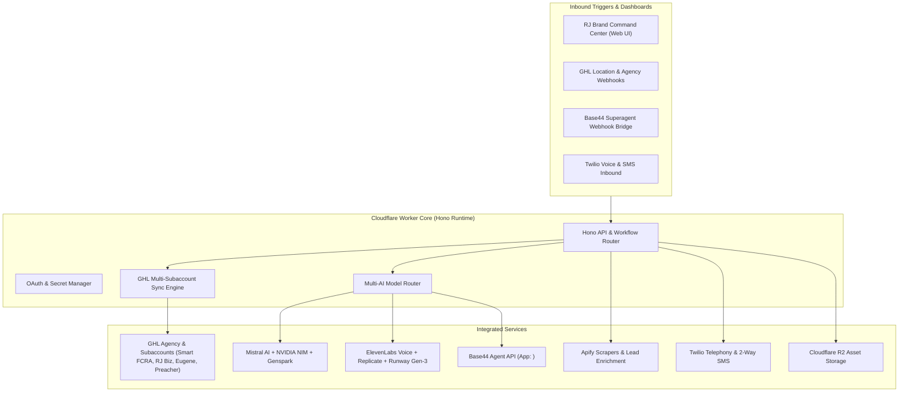

# RJ Business Solutions · Unified Cloudflare Edge & GoHighLevel Multi-Location Automation Engine

## Overview
Connect and deploy a production-grade Cloudflare-native autonomous automation engine for Rick Jefferson / RJ Business Solutions. The system unifies GoHighLevel (Agency level + 4 subaccounts), multi-modal AI engines (Mistral AI, NVIDIA NIM, ElevenLabs, Replicate, Runway, Genspark, Base44 Superagent), Apify lead intelligence, Twilio communication infrastructure, and Cloudflare R2 storage — styled in strict adherence to the RJ Business Solutions Brand Universe.

---

## 1. System Architecture & Credential Matrix

### Verified Target Subaccounts & Credentials
1. **GoHighLevel Agency Hub**:
   - Agency PIT: `pit-defef847-98c6-4d10-937b-b42038ecd494`
   - Relationship Number: `0-908-802`
   - OAuth Marketplace App Client ID: `<REDACTED>` / Secret: `<REDACTED>`
2. **Subaccounts**:
   - **RJ BUSINESS SOLUTIONS**: Location `DvKRMVD9YudoS6xRyBfb` | PIT `pit-c04bf7cf-69e6-44b1-b7a6-7bcaf255b609` (Primary Brand Hub)
   - **SMART FCRA**: Location `aBL9bEdg3LoPKJ9RhPzE` | PIT `pit-a581a001-f6e1-4c8b-81ce-769d65ed3cf3` (FCRA & Credit Tech)
   - **Eugene**: Location `1J5ooApb6gIuDiOen20e` | PIT `pit-163f4730-3285-4730-a7ff-b8ca5c7f7bfc`
   - **Contracting Preacher**: Location `wBPmIpkN5dcwCCSc2kwz` | PIT `pit-098de1dd-9bfc-436f-b242-957483210ddb`
3. **AI & Media Providers**:
   - **Mistral AI**: API Key `<REDACTED>`
   - **NVIDIA NIM**: API Key `<REDACTED>`
   - **ElevenLabs**: Voice Key `<REDACTED>`
   - **Replicate**: `<REDACTED>A`
   - **Runway Gen-3**: `<REDACTED>`
   - **Genspark**: `gsk-eyJjb2dlbl9pZCI6...`
   - **Base44 Superagent**: App ID `<REDACTED>`, Token `<REDACTED>`
4. **Cloudflare Storage & Infrastructure**:
   - Account ID: `58250b56ae5b45d940cd6e4b64314c01`
   - API Token: `<REDACTED>`
   - R2 Access Key: `<REDACTED>` / Secret: `<REDACTED>`
   - R2 S3 Endpoint: `https://58250b56ae5b45d940cd6e4b64314c01.r2.cloudflarestorage.com`
5. **Telephony & Lead Scraper**:
   - **Twilio**: SID `<REDACTED>`, Auth Token `<REDACTED>`, Phone `+1-866-752-4618`
   - **Apify**: API Token `<REDACTED>`, User `KNXxxRcLwWDEFOPNG`

---

## 2. Proposed Changes & Implementation Steps

### Component 1: Cloudflare Edge Worker API (`rj-agency-omega`)
- Multi-provider HTTP backend powered by Hono.
- Safe credential management and environment variable bindings (`.env`, `wrangler.jsonc`).
- Service clients:
  - `ghlClient.ts`: GoHighLevel v2 API client supporting Agency endpoints, Location switches, Custom Fields, Contacts, Tags, Pipelines, and Opportunities across all 4 subaccounts.
  - `aiRouter.ts`: Unified AI caller orchestrating Mistral, NVIDIA NIM, ElevenLabs, Replicate, Runway, and Genspark.
  - `base44Client.ts`: Direct conversational integration & webhook receiver with HMAC signature verification.
  - `r2Storage.ts`: Direct S3-compatible R2 upload, asset indexing, and CDN URL generator for creatives and voice memos.
  - `apifyClient.ts`: Trigger and retrieve lead scrape results (B2B leads, social media profiles).
  - `twilioClient.ts`: Outbound SMS, call forwarding, and 2-way conversation tracking.

### Component 2: Multi-Subaccount Automated Sync & Workflows
- **Sync Engine**: Automatically configure standard Custom Fields (e.g. `AI Lead Score`, `Last AI Summary`, `Voice Note URL`, `Audit Stage`), standard tags (`ai-engaged`, `needs-human`, `fcra-audit-ready`), and default pipelines across all 4 subaccounts.
- **Webhook Handlers**:
  - Inbound Contact/Message Created -> AI Lead Scoring & Intent Analysis (Mistral) -> Base44 agent dialogue response -> Voice note generation (ElevenLabs) -> SMS delivery (Twilio / GHL).
  - High Intent -> Pipeline Stage update & Alert notification.

### Component 3: RJ Brand Command Center & Dashboard UI
- Full web application styled using the **RJ Business Solutions Brand Universe**:
  - Colors: `#2563eb` Primary Blue, `#0ea5e9` Sky, `#0f172a` Navy, `#1e3a8a` Deep Blue.
  - Typography: Space Grotesk headers & mono badges, Inter body text.
  - Live Subaccount Manager (status checks for Smart FCRA, RJ Biz, Eugene, Contracting Preacher).
  - Live AI Test Sandbox (Run prompt through Mistral/NVIDIA/ElevenLabs/Runway/Replicate/Base44 in real-time).
  - Lead Generation Runner (Trigger Apify leads into GHL with 1-click).
  - Webhook & Workflow monitor.

---

## 3. Verification Plan

### Automated Tests & Live Verification
- **Cloudflare API Verification**: Verify Cloudflare token with `verify` endpoint.
- **GHL Agency & Subaccount Connectivity**: Test API connectivity with Agency PIT and individual location tokens.
- **AI Engine Pings**: Run live inference tests across Mistral AI, NVIDIA NIM, ElevenLabs voice synthesis, and Base44 Agent API.
- **R2 S3 Upload Test**: Verify object storage write/read cycle to Cloudflare R2 bucket.
- **Twilio SMS & Apify Verification**: Verify account balances/capabilities and active scraper actors.
- **Build & TypeScript Typecheck**: Run `npm run build` / `npx tsc --noEmit` to guarantee 0 build or lint errors.

### Manual Verification
- Verify the interactive Command Center UI in the browser.
- Test cross-location synchronization triggers and webhook payloads.
